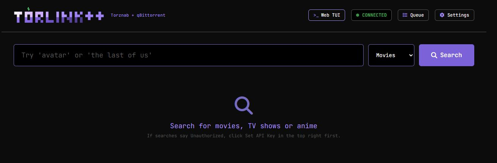
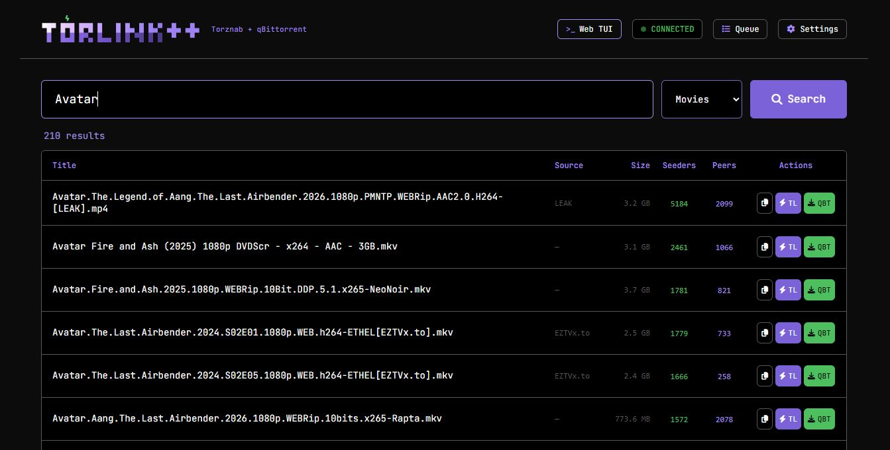
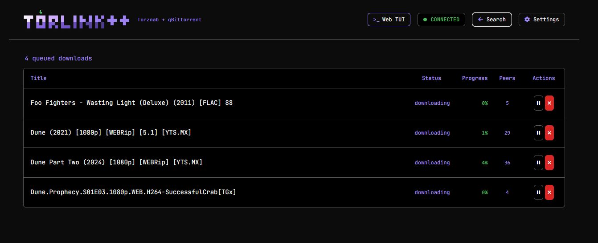
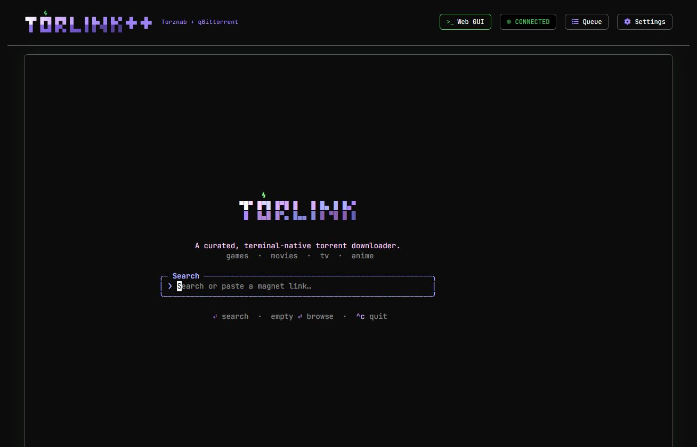

<p align="center">
  
</p>

# TorLink++

TorLink++ is a self-hosted Torznab + torrent-download gateway built on top of the original [Torlink](https://github.com/baairon/torlink) terminal torrent finder/downloader.

The original Torlink project, its terminal TUI, curated search experience, source integrations, and downloader foundation were created by **bairon / baairon**. Full credit for that original work belongs to the original author. This repository is a fork that adds a LAN-friendly web layer and automation integrations around that foundation.
<p align="center">
  
</p>

## What TorLink++ adds

TorLink++ keeps the native Torlink terminal experience and adds two major capabilities:

1. **Torznab indexer API for automation apps**
   - Exposes a Torznab-compatible endpoint for Radarr/Sonarr-style indexer integrations.
   - Supports `/api?t=caps` and search responses that automation apps can validate.
   - Uses a configurable API key for Radarr/Sonarr and other clients.
<p align="center">
  
</p>

2. **Web interface for LAN use**
   - Search from a browser.
   - Queue downloads into the built-in Torlink downloader.
   - Send magnets to qBittorrent when configured.
   - View the built-in downloader queue.
   - Open the real native Torlink TUI embedded in the browser through an xterm.js + PTY bridge.
<p align="center">
  
  
</p>
## Why this exists

The original Torlink is a polished terminal-native torrent finder/downloader. TorLink++ is for homelab users who want that same curated search/downloader base to also work with:

- Radarr
- Sonarr
- browser-based searching
- a LAN-hosted web UI
- qBittorrent handoff
- Docker/Unraid deployments

Best of all the FULL native TUI is avalible as well via a embedded Terminal. Accessable from anywhere on your network.
<p align="center">
  
</p>

## Quick start with Docker Compose

Use the published Docker Hub image:

```yaml
services:
  torlink:
    image: calmasacow/torlink-plusplus:latest
    container_name: torlink
    restart: unless-stopped
    ports:
      - "19117:9117"
    environment:
      TORLINK_API_KEY: "replace-with-a-long-random-api-key"
      TORLINK_WEBUI_TRUSTED: "true"
      TORLINK_DOWNLOAD_DIR: "/downloads"
      TORLINK_TORZNAB_EMPTY_QUERY: "avatar"
    volumes:
      - /path/on/host/torlink-downloads:/downloads
```

Then open:

```text
http://YOUR_SERVER:19117/
```

For Radarr/Sonarr, use the Torznab URL:

```text
http://YOUR_SERVER:19117/api?apikey=YOUR_API_KEY
```

## Docker Hub image

Docker Hub image:

```text
calmasacow/torlink-plusplus:latest
```

Versioned tags are published from Git tags such as `v0.1.0`.

## Download path

Inside the container, TorLink++ writes built-in downloader files to:

```text
/downloads
```

Map that container path to the host folder you want. For example, on Unraid:

```text
/host-local-location/downloads:/downloads
```

The native embedded TUI and the browser Web UI both use the same `/downloads` target when `TORLINK_DOWNLOAD_DIR=/downloads` is set.

## Web UI modes

The header includes quick navigation between:

- **Web GUI**: browser search, queue, settings, and qBittorrent actions.
- **Web TUI**: the actual native Torlink terminal UI embedded in the browser using xterm.js and a server-side PTY.
- **Queue**: active built-in downloader queue, with the Queue button toggling back to Search.

## Local development

Requires Node 22+ and pnpm.

```sh
pnpm install --config.dangerously-allow-all-builds=true
pnpm run typecheck
pnpm run test
pnpm run build
```

Run the terminal app:

```sh
pnpm run dev
```

Run the web/Torznab server after building:

```sh
pnpm run build
node dist/index.js serve
```

## Attribution

TorLink++ is a fork of the original Torlink project by **bairon / baairon**:

- Original repository: https://github.com/baairon/torlink
- Original author: bairon.dev / hi@bairon.dev

The original project deserves the credit for the native TUI, core torrent search/downloader concept, and curated source experience. TorLink++ extends that work with a web interface, Torznab API, qBittorrent handoff, Docker/Unraid-oriented deployment, and embedded browser TUI support.

## License

MIT, following the original Torlink project license.
